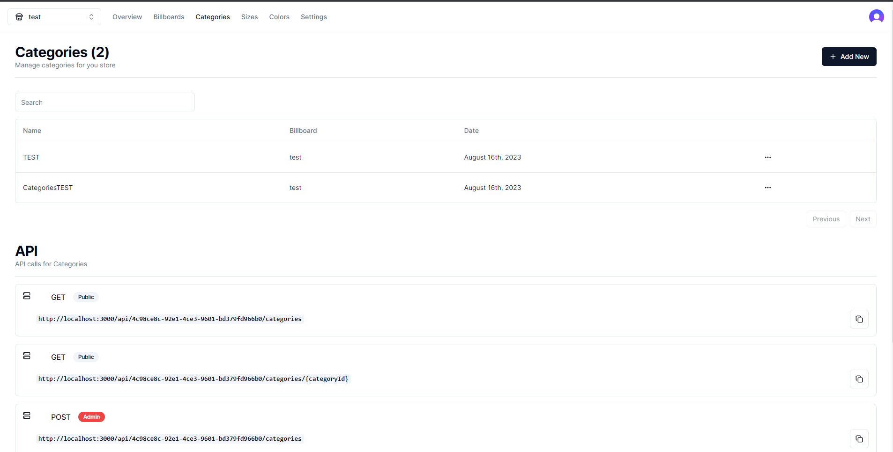

# Content Manager System

Conceptualized and developed a comprehensive Content Management System (CMS), designed to provide a user-friendly platform for content creation and management.

## Tech Stack

**Client:** Nextjs, Prisma, TailwindCSS, Zustand, ShadcnUI

**Server:** Nextjs, Clerk, MySQL, Prisma, Stripe


## Environment Variables

To run this project, you will need to add the following environment variables to your .env file

`CLERK_SECRET_KEY`

`NEXT_PUBLIC_CLERK_PUBLISHABLE_KEY`

`NEXT_PUBLIC_CLOUDINARY_CLOUD_NAME`

`DATABASE_URL`

`NEXT_PUBLIC_CLERK_SIGN_IN_URL=/sign-in`

`NEXT_PUBLIC_CLERK_SIGN_UP_URL=/sign-up`

`NEXT_PUBLIC_CLERK_AFTER_SIGN_IN_URL=/`

## Run Locally

Clone the project

```bash
  git clone https://github.com/Vladyslavua3/CMS-System.git
```

Go to the project directory

```bash
  cd my-project
```

Install dependencies

```bash
  npm install
```

Start the server

```bash
  npm run start
```


## Screenshots



